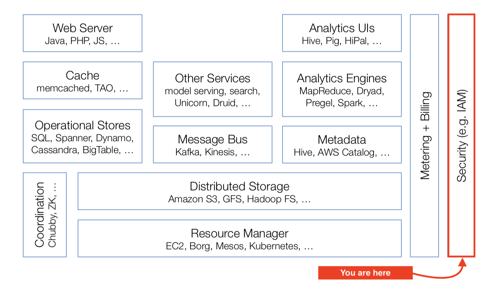

# Awesome Identity and Access Management

In a [Cloud computing overview Standford class](http://web.stanford.edu/class/cs349d/docs/L01_overview.pdf), the cloud software stack is presented as such:

This knowledge base cover the far right perimeter of the cloud stack. It is one of the pillar of the cloud ecosystem, bridging the users, the products and the business. The [other pillar being billing & payments](https://github.com/kdeldycke/awesome-billing/).

## Meta

* [IAM definition](https://en.wikipedia.org/wiki/Identity_management)
* [*As a user, I want _____*](https://mobile.twitter.com/oktopushup/status/1030457418206068736) - A meta-critic of account management, in which features informed by the business clash with a real user expectations, in the form of user stories written by a fictional project manager.
* [Things end users care about but programmers don't](https://instadeq.com/blog/posts/things-end-users-care-about-but-programmers-dont/) - In the same spirit as above, but broader: all the little things we overlook as developers but users really care about. In the top of that list lies account-centric features, diverse integration and import/export tools. I.e. all the enterprise customers needs to cover.

## Basics

* [Enterprise Information Security](https://infosec.mozilla.org) -  Mozilla's security and access guidelines.
* [Open guide to AWS Security and IAM](https://github.com/open-guides/og-aws#security-and-iam)
* [IAM Is The Real Cloud Lock-In](https://forrestbrazeal.com/2019/02/18/cloud-irregular-iam-is-the-real-cloud-lock-in/) - A little *click-baity*, but author admit that `It depends on how much you trust them to a) stay in business; b) not jack up your prices; c) not deprecate services out from under you; and d) provide more value to you in business acceleration than they take away in flexibility.`

## Cryptography

* [Cryptographic Right Answers](https://latacora.micro.blog/2018/04/03/cryptographic-right-answers.html) ([summary](https://news.ycombinator.com/item?id=16749140)) - An up to date set of recomendations for developers who are not cryptography engineers.
* [Real World Crypto Symposium](https://rwc.iacr.org) - Aims to bring together cryptography researchers with developers, focusing on uses in real-world environments such as the Internet, the cloud, and embedded devices.
* [An Overview of Cryptography](https://www.garykessler.net/library/crypto.html) - `This paper has two major purposes. The first is to define some of the terms and concepts behind basic cryptographic methods, and to offer a way to compare the myriad cryptographic schemes in use today. The second is to provide some real examples of cryptography in use today.`

## Zero-trust Network

Zero trust network security operates under the principle “never trust, always verify.”.

* [BeyondCorp - A New Approach to Enterprise Security](https://www.usenix.org/system/files/login/articles/login_dec14_02_ward.pdf) - Quick overview of Google’s Zero-trust Network initiative.
* [What is BeyondCorp? What is Identity-Aware Proxy?](https://medium.com/google-cloud/what-is-beyondcorp-what-is-identity-aware-proxy-de525d9b3f90) - More companies add extra layers of VPNs, firewalls, restrictions and constraints, resulting in a terrible experience and a slight security gain. There’s a better way.
* [oathkeeper](https://github.com/ory/oathkeeper) - Identity & Access Proxy and Access Control Decision API that authenticates, authorizes, and mutates incoming HTTP requests. Inspired by the BeyondCorp / Zero Trust white paper.
* [transcend](https://github.com/cogolabs/transcend) - BeyondCorp-inspired Access Proxy server.

## Authentication

* [Scaling backend authentication at Facebook](https://www.youtube.com/watch?v=kY-Bkv3qxMc) ([slides](https://rwc.iacr.org/2018/Slides/Lewi.pdf)) - TL;DR: Small root of trust, TLS isn't enough, certificate-based tokens and Crypto Auth Tokens (CATs).
* [Secret at Scale at Netflix](https://www.youtube.com/watch?v=K0EOPddWpsE) ([slides](https://rwc.iacr.org/2018/Slides/Mehta.pdf)) - Solution based on blind signatures.
* [High Availability in Google's Internal KMS](https://www.youtube.com/watch?v=5T_c-lqgjso) ([slides](https://rwc.iacr.org/2018/Slides/Kanagala.pdf)) - Not GCP's KMS, but the one at the code of their infrastructure.

## Secret Management

* [`vault`](https://www.vaultproject.io) - Secure, store and tightly control access to tokens, passwords, certificates, encryption keys.
* [`sops`](https://github.com/mozilla/sops) - Encrypts the values of YAML and JSON files, not the keys.
* [`gitleaks`](https://github.com/zricethezav/gitleaks) - Audit git repos for secrets.
* [Keywhiz](https://square.github.io/keywhiz/) - A system for managing and distributing secrets, which can fit well with a service oriented architecture (SOA).

## Hardware Security Module (HSM)

HSMs are physical devices guaranteeing security of secret management at the hardware level.

* [HSM: What they are and why it's likely that you've (indirectly) used one today](https://rwc.iacr.org/2015/Slides/RWC-2015-Hampton.pdf) - Really basic overview of HSM usages.
* [Tidbits on AWS Cloud HSM hardware](https://news.ycombinator.com/item?id=16759383) - AWS CloudHSM Classic is backed by SafeNet's Luna HSM, current CloudHSM rely on Cavium's Nitrox, which allows for partitionable "virtual HSMs".
* [CrypTech](https://cryptech.is) - An open hardware HSM.
* [Keystone](https://keystone-enclave.org) - Open-source project for building trusted execution environments (TEE) with secure hardware enclaves, based on the RISC-V architecture.
* [Everybody be cool, this is a robbery!](https://www.sstic.org/2019/presentation/hsm/) - A case study of vulnerability and exploitability of a HSM (in French, sorry).

## Public-Key Infrastructure (PKI)

Certificate-based authentication.

* [PKI for busy people](https://rehn.me/posts/pki-for-busy-people.html) - Quick overview of the important stuff.
* [Everything you should know about certificates and PKI but are too afraid to ask](https://smallstep.com/blog/everything-pki.html) - PKI lets you define a system cryptographically. It’s universal and vendor neutral.
* [`lemur`](https://github.com/Netflix/lemur) - Acts as a broker between CAs and environments, providing a central portal for developers to issue TLS certificates with 'sane' defaults.

## Authorization, ACL and RBAC

All things related to access control policies, from classic [Access Control Lists](https://en.wikipedia.org/wiki/Access-control_list) to [Role Based Access Control](https://en.wikipedia.org/wiki/Role-based_access_control).

* [Zanzibar: Google’s Consistent, Global Authorization System](https://ai.google/research/pubs/pub48190) - scales to
trillions of access control lists and millions of authorization requests per second to support services used by
billions of people. It has maintained 95th-percentile latency of less than 10 milliseconds and availability of
greater than 99.999% over 3 years of production use. [Other bits not in the paper](https://twitter.com/LeaKissner/status/1136626971566149633).
* [Role Based Access Control](https://csrc.nist.gov/projects/role-based-access-control) - NIST project to explaine RBAC concepts, costs and benefits, the economic impact of RBAC, design and implementation issues, the RBAC standard, and advanced research topics.
* [keto](https://github.com/ory/keto) - Policy decision point. It uses a set of access control policies, similar to AWS IAM Policies, in order to determine whether a subject is authorized to perform a certain action on a resource.
* [ladon](https://github.com/ory/ladon) - Access control library, inspired by [AWS IAM Policies](http://docs.aws.amazon.com/IAM/latest/UserGuide/access_policies.html).

## Policies

* [Become an AWS IAM Policy Ninja](https://www.youtube.com/watch?v=y7-fAT3z8Lo) - `In my nearly 5 years at Amazon, I carve out a little time each day, each week to look through the forums, customer tickets to try to find out where people are having trouble.`. Policy specification is the science, enforcement is the art.

## Password-based Authentication

* [The new nist password guidance](https://pciguru.wordpress.com/2019/03/11/the-new-nist-password-guidance/) - A summary of [NIST Special Publication 800-63B](https://pages.nist.gov/800-63-3/sp800-63b.html) covering new password complexity guidelines.
* [Password expiration is dead](https://techcrunch.com/2019/06/02/password-expiration-is-dead-long-live-your-passwords/) - Recent scientific research calls into question the value of many long-standing password-security practices such as password expiration policies, and points instead to better alternatives such as enforcing banned-password lists and MFA.
* [Banks, Arbitrary Password Restrictions and Why They Don't Matter](https://www.troyhunt.com/banks-arbitrary-password-restrictions-and-why-they-dont-matter/) - `Arbitrary low limits on length and character composition are bad. They look bad, they lead to negative speculation about security posture and they break tools like password managers.`
* [Dumb Password Rules](https://github.com/dumb-password-rules/dumb-password-rules) - Shaming sites with dumb password rules.
* [Plain Text Offenders](https://plaintextoffenders.com/about/) - Public shaming of websites storing passwords in plain text.
* [A Well-Known URL for Changing Passwords](https://github.com/WICG/change-password-url) - Specification defining site resource for password updates.

## Password-less Authentication

* [An argument for passwordless](https://biarity.gitlab.io/2018/02/23/passwordless/) - Passwords are not the be-all and end-all of user authentication. This article ties to tell you why.
* [Webauthn and security keys](https://www.imperialviolet.org/2018/03/27/webauthn.html) - WebAuthn is a replacement for password authentication.
* [Getting started with security keys](https://paulstamatiou.com/getting-started-with-security-keys/) - A practical guide to stay safe online and prevent phishing with FIDO2, WebAuthn and security keys.

## Multi-Factor Authentication

* [Beyond Passwords: 2FA, U2F and Google Advanced Protection](https://www.troyhunt.com/beyond-passwords-2fa-u2f-and-google-advanced-protection/) - An excellent walk-trough over all these technologies.
* [A Comparative Long-Term Study of Fallback Authentication](https://www.mobsec.ruhr-uni-bochum.de/media/mobsec/veroeffentlichungen/2019/02/20/usec2019-30-wip-fallback-long-term-study-finalv2.pdf) - Key take-away: `schemes based on email and SMS are more usable. Mechanisms based on designated trustees and personal knowledge questions, on the other hand, fall short, both in terms of convenience and efficiency.`
* [How effective is basic account hygiene at preventing hijacking](https://security.googleblog.com/2019/05/new-research-how-effective-is-basic.html) - Google security team's data shows 2FA blocks 100% of automated bot hacks.
* [Your Pa$$word doesn't matter](https://techcommunity.microsoft.com/t5/Azure-Active-Directory-Identity/Your-Pa-word-doesn-t-matter/ba-p/731984) - Same conclusion as above from Microsoft: `Based on our studies, your account is more than 99.9% less likely to be compromised if you use MFA.`
* [Attacking Google Authenticator](https://unix-ninja.com/p/attacking_google_authenticator) - Probably on the verge of paranoia, but might be a reason to rate limit 2FA validation attempts.
* [Compromising online accounts by cracking voicemail systems](https://www.martinvigo.com/voicemailcracker/) - Or why you should not rely on automated phone calls as a method to reach the user and reset passwords, 2FA or for any kind of verification. Not unlike SMS-based 2FA, it is currently insecure and can be compromised by the way of its weakest link: voicemail systems.
* [Getting 2FA Right in 2019](https://blog.trailofbits.com/2019/06/20/getting-2fa-right-in-2019/) - On the UX aspects of 2FA.

## SMS-based Authentication

TL;DR: don't. For details, see articles below.

* [SMS 2FA auth is deprecated by NIST](https://techcrunch.com/2016/07/25/nist-declares-the-age-of-sms-based-2-factor-authentication-over/) - NIST has said that 2FA via SMS is bad and awful since 2016.
* [SMS: The most popular and least secure 2FA method](https://www.allthingsauth.com/2018/02/27/sms-the-most-popular-and-least-secure-2fa-method/)
* [Hackers Hit Twitter C.E.O. Jack Dorsey in a ‘SIM Swap.’ You’re at Risk, Too.](https://www.nytimes.com/2019/09/05/technology/sim-swap-jack-dorsey-hack.html)
* [AT&T rep handed control of his cellphone account to a hacker](https://www.theregister.co.uk/2017/07/10/att_falls_for_hacker_tricks/)
* [The Most Expensive Lesson Of My Life: Details of SIM port hack](https://medium.com/coinmonks/the-most-expensive-lesson-of-my-life-details-of-sim-port-hack-35de11517124)
* [SIM swap horror story](https://www.zdnet.com/article/sim-swap-horror-story-ive-lost-decades-of-data-and-google-wont-lift-a-finger/)
* [AWS is on its way to deprecate SMS-based 2FA](https://aws.amazon.com/iam/details/mfa/) - `We encourage you to use MFA through a U2F security key, hardware device, or virtual (software-based) MFA device. You can continue using this feature until January 31, 2019.`

## JWT

[JSON Web Token](https://en.wikipedia.org/wiki/JSON_Web_Token) is a bearer's token.

* [Introduction to JSON Web Tokens](https://jwt.io/introduction/) - Get up to speed on JWT with this article.
* [Learn how to use JWT for Authentication](https://github.com/dwyl/learn-json-web-tokens) - Learn how to use JWT to secure your web app.
* [Using JSON Web Tokens as API Keys](https://auth0.com/blog/using-json-web-tokens-as-api-keys/) - Compared to API keys, JWTs offers granular security, homogenous auth architecture, decentralized issuance, OAuth2 compliance, debuggability, expiration control, device management.
* [Managing a Secure JSON Web Token Implementation](https://cursorblog.com/managing-a-secure-json-web-token-implementation/) - JWT has all sorts of flexibility that make it hard to use well.
* [Blacklisting JSON Web Token API Keys](https://auth0.com/blog/blacklist-json-web-token-api-keys/) - On token invalidation.
* [Stop using JWT for sessions](http://cryto.net/~joepie91/blog/2016/06/13/stop-using-jwt-for-sessions/), and [Why your "solution" doesn't work](http://cryto.net/%7Ejoepie91/blog/2016/06/19/stop-using-jwt-for-sessions-part-2-why-your-solution-doesnt-work/) - Stateless JWT [tokens cannot be invalidated or updated](https://news.ycombinator.com/item?id=18354141), and will introduce either size issues or security issues depending on where you store them. Stateful JWT tokens are functionally the same as session cookies, but without the battle-tested and well-reviewed implementations or client support. 
* [JWT, JWS and JWE for Not So Dummies!](https://medium.facilelogin.com/jwt-jws-and-jwe-for-not-so-dummies-b63310d201a3) - A signed JWT is known as a JWS (JSON Web Signature). In fact a JWT does not exist itself — either it has to be a JWS or a JWE (JSON Web Encryption). Its like an abstract class — the JWS and JWE are the concrete implementations.
* [JOSE is a Bad Standard That Everyone Should Avoid](https://paragonie.com/blog/2017/03/jwt-json-web-tokens-is-bad-standard-that-everyone-should-avoid) - TL;DR: the standards are either completely broken or complex minefields hard to navigate.
* [JWT.io](https://jwt.io) - Allows you to decode, verify and generate JWT.

## Macaroons

A clever curiosity to distribute and delegate authorization.

* [Google's Macaroons in Five Minutes or Less](https://blog.bren2010.io/2014/12/04/macaroons.html) - TL;DR: if I’m given a Macaroon that authorizes me to perform some action(s) under certain restrictions, I can non-interactively build a second Macaroon with stricter restrictions that I can then give to you.
* [Macaroons: Cookies with Contextual Caveats for Decentralized Authorization in the Cloud](https://ai.google/research/pubs/pub41892) - Google's original paper.
* [Google paper's author compares Macaroons and JWTs](https://news.ycombinator.com/item?id=14294463) - TL;DR: As a consumer/verifier of macaroons, they allow you (through third-party caveats) to defer some authorization decisions to someone else. JWTs don't.

## OAuth2 & OpenID

[OAuth 2.0](https://en.wikipedia.org/wiki/OAuth#OAuth_2.0) is an authorization framework. [OpenID Connect (OIDC)](https://en.wikipedia.org/wiki/OpenID_Connect) is an authentication layer on top of it.

The old *OpenID* is dead; the new *OpenID Connect* is very much not-dead.

* [An Illustrated Guide to OAuth and OpenID Connect](https://developer.okta.com/blog/2019/10/21/illustrated-guide-to-oauth-and-oidc) - Explain how these standards work using simplified illustrations.
* [OAuth 2 Simplified](https://aaronparecki.com/oauth-2-simplified/) - A reference article describing the protocol in simplified format to help developers and service providers implement it.
* [The Decline of OpenID](https://penguindreams.org/blog/the-decline-of-openid/) - OpenID is being replaced in the public web to a mix of OAuth 1, OAuth 2 or other proprietary SSO protocols.
* [Hydra](https://gethydra.sh) - Open-source OIDC & OAuth2 Server.
* [Cierge](https://pwdless.github.io/Cierge-Website/) - Open-source authentication server (OIDC) that handles user signup, login, profiles, management, and more.
* [Keycloak](https://www.keycloak.org) - Open-source Identity and Access Management. Supports OIDC, OAuth 2
and SAML 2, LDAP and AD directories, password policies.
* [Open-Sourcing BuzzFeed’s SSO Experience](https://increment.com/security/open-sourcing-buzzfeeds-single-sign-on-process/) - OAuth2-friendly adaptation of the Central Authentication Service (CAS) protocol. You'll find there good OAuth user flow diagrams.

## SAML

SAML 2.0 is a means to exchange authorization and authentication between services, like OAuth/OpenID protocols above.

Typical SAML identity prodiver is an insitution or a big corporation's internal SSO, while the typical OIDC/OAuth provider is a tech company that runs a data silo.

* [How SAML 2.0 Authentication Works](https://gravitational.com/blog/how-saml-authentication-works/) - Overview of the how and why of SSO and SAML.
* [Web Single Sign-On, the SAML 2.0 perspective](https://blog.theodo.com/2019/06/web-single-sign-on-the-saml-2-0-perspective/) - Another naive explanation of SAML workflow in the context of corporate SSO implementation.

## User Identity

On managing users and their metadata.

* [hive](https://github.com/ory/hive) - User & Identity Provider & Management.

## Fraud

Managing users expose services and businesses to fraud, crime, abuses, trust and safety. You should never underestimate how much cleverer than you people will be when it comes to money.

* [After Car2Go eased its background checks, 75 of its vehicles were stolen in one day.](https://archive.is/MuNrZ) - Why background check are sometimes necessary.
* [Investigation into the Unusual Signups](https://openstreetmap.lu/MWGGlobalLogicReport20181226.pdf) - A really detailed analysis of suspicious contributor signups on OpenStreetMap. This beautiful and high-level report demonstrating an orchestrated and directed campaign might serve as a template for fraud reports.
* [Browser Fingerprinting: A survey](https://arxiv.org/pdf/1905.01051.pdf) - Fingerprints can be used as a source of signals to identify bots and fraudsters.
 

## Captcha

* [Anti-captcha](https://anti-captcha.com) - Captchas solving service.

## Blacklists

The first mecanical line of defense against fraud and abuses consist in plain and simple blacklisting.

### Hostnames and Subdomains

* [`hosts`](https://github.com/StevenBlack/hosts) - Consolidates reputable hosts files, and merges them into a unified hosts file with duplicates removed.
* [The Public Suffix List](https://publicsuffix.org) - Mozilla's registry of public suffixes, under which Internet users can (or historically could) directly register names.
* [Certificate Transparency Subdomains](https://github.com/internetwache/CT_subdomains) - An hourly updated list of subdomains gathered from certificate transparency logs.
* Subdomain blacklists: [#1](https://gist.github.com/artgon/5366868), [#2](https://github.com/sandeepshetty/subdomain-blacklist/blob/master/subdomain-blacklist.txt), [#3](https://github.com/nccgroup/typofinder/blob/master/TypoMagic/datasources/subdomains.txt), [#4](https://www.quora.com/How-do-sites-prevent-vanity-URLs-from-colliding-with-future-features).

### Emails

* [Burner email providers](https://github.com/wesbos/burner-email-providers) - A list of temporary email providers. And its [derivated Python module](https://github.com/martenson/disposable-email-domains).
* [MailChecker](https://github.com/FGRibreau/mailchecker) - Cross-language temporary (disposable/throwaway) email detection library.
* [Temporary Email Address Domains](https://gist.github.com/adamloving/4401361) - A list of domains for disposable and temporary email addresses. Useful for filtering your email list to increase open rates (sending email to these domains likely will not be opened).

### Reserved IDs

* [General List of Reserved Words](https://gist.github.com/stuartpb/5710271) - This is a general list of words you may want to consider reserving, in a system where users can pick any name.
* [Hostnames and usernames to reserve](https://ldpreload.com/blog/names-to-reserve) - List of all the names that should be restricted from registration in automated systems.

### Profanity

* [List of Dirty, Naughty, Obscene, and Otherwise Bad Words](https://github.com/LDNOOBW/List-of-Dirty-Naughty-Obscene-and-Otherwise-Bad-Words) - Profanity blacklist from Shutterstock.

## Privacy

As the guardian of user's data, the IAM stack is deeply bounded by the respect of privacy.

* [IRMA Authentication](https://news.ycombinator.com/item?id=20144240) - Open-source app and protocol that offers privacy-friendly attribute based authentication and signing using [Camenisch and Lysyanskaya's Idemix](https://privacybydesign.foundation/publications/).
* [Have I been Pwned?](https://haveibeenpwned.com) - Data breach index.
* [Automated security testing for Software Developers](https://fahrplan.events.ccc.de/camp/2019/Fahrplan/system/event_attachments/attachments/000/003/798/original/security_cccamp.pdf) - Most privacy breaches were allowed by known vulnerabilities in third-party dependencies. Here is how to detect them by the way of CI/CD.

## GDPR

The well-known European privacy framework

* [GDPR Tracker](https://gdprtracker.io) - Track the GDPR compliance of cloud services and subprocessors.
* [GDPR documents](https://github.com/good-lly/gdpr-documents) - Templates for personal use to have companies comply with "Data Access" requests.
* [Ship Your Enemies GDPR](https://shipyourenemiesgdpr.com) - Weaponizing GDPR to help you send your enemies a Data Requests designed to waste as much of their time as possible.
* [GDPR Enforcement Tracker](http://enforcementtracker.com) - List of GDPR fines and penalties.

## Anonymization

As a central repository of user data, the IAM stack stakeholders have to prevent any leakage of business and customer data. To allow for internal analytics, anonymization is required.

* [The False Allure of Hashing for Anonymization](https://gravitational.com/blog/hashing-for-anonymization/) - Hashing is not sufficient for anonymization no. But still it is good enough for pseudonymization.
* [Why differential privacy is awesome](https://desfontain.es/privacy/differential-privacy-awesomeness.html) - Explain the intuition behind [differential privacy](https://en.wikipedia.org/wiki/Differential_privacy), a theoretical framework which allow sharing of aggregated data without compromising confidentiality. See follow-up articles with [more details](https://desfontain.es/privacy/differential-privacy-in-more-detail.html) and [pracical aspects](https://desfontain.es/privacy/differential-privacy-in-practice.html).
* [Presidio](https://github.com/microsoft/presidio) - Context aware, pluggable and customizable data protection and PII data anonymization service for text and images.
* [Diffix: High-Utility Database Anonymization](https://aircloak.com/wp-content/uploads/apf17-reprint.pdf) - Diffix try to provide anonymization, avoid pseudonymization and preserve data quality. [Written in Elixir at Aircloak](https://elixirforum.com/t/aircloak-anonymized-analitycs/10930), it acts as an SQL proxy between the analyst and an unmodified live database.

## UX/UI

* [Conversion Optimization](https://www.nickkolenda.com/conversion-optimization-psychology/#cro-tactic11) - A collection of tactics to increase the chance of users finishing the account creation funnel.
* [Don’t get clever with login forms](http://bradfrost.com/blog/post/dont-get-clever-with-login-forms/) - TL;DR; create login forms that are simple, linkable, predictable, and play nicely with password managers.
* [Why are the username and password on two different pages?](https://www.twilio.com/blog/why-username-and-password-on-two-different-pages) - TL;DR: to support both SSO and password-based login.
* [Remove password masking](http://passwordmasking.com) - Summarises the results from an academic study investigating the impact removing password masking has on consumer trust.
* [For anybody who thinks "I could build that in a weekend," this is how Slack decides to send a notification](https://twitter.com/ProductHunt/status/979912670970249221) - Notifications are hard. Really hard.

## Open-Source Projects

* [Open Policy Agent](https://github.com/open-policy-agent/opa)
* [Casbin](https://github.com/casbin/casbin)
* [IdentityServer](https://identityserver.io)
* [gluu](https://www.gluu.org)
* [Conjur](https://www.conjur.org)

## Competitive Analysis

A bunch of resources to keep track of the current status and progress of all companies operating in the domain.

* [AWS Security, Identity & Compliance announcements](https://aws.amazon.com/about-aws/whats-new/security_identity_and_compliance/).
* [GCP IAM release notes](https://cloud.google.com/iam/docs/release-notes) - Also of note: [Identity](https://cloud.google.com/identity/docs/release-notes), [Identity Platform](https://cloud.google.com/identity-platform/docs/release-notes), [Resource Manager](https://cloud.google.com/resource-manager/docs/release-notes), [Key Management Service/HSM](https://cloud.google.com/kms/docs/release-notes), [Access Context Manager](https://cloud.google.com/access-context-manager/docs/release-notes), [Identity-Aware Proxy](https://cloud.google.com/iap/docs/release-notes), [Data Loss Prevention](https://cloud.google.com/dlp/docs/release-notes) and [Security Scanner](https://cloud.google.com/security-scanner/docs/release-notes).
* [Unofficial Weekly Google Cloud Platform newsletter](https://www.gcpweekly.com) - Relevant keywords: [`IAM`](https://www.gcpweekly.com/gcp-resources/tag/iam/) and [`Security`](https://www.gcpweekly.com/gcp-resources/tag/security/).
* [DigitalOcean Platform changelog](https://www.digitalocean.com/docs/platform/release-notes/)

## History

* [cryptoanarchy.wiki](https://cryptoanarchy.wiki) - Cypherpunks overlaps with security. This wiki compiles information about the movement, its history and the people/events of note.
