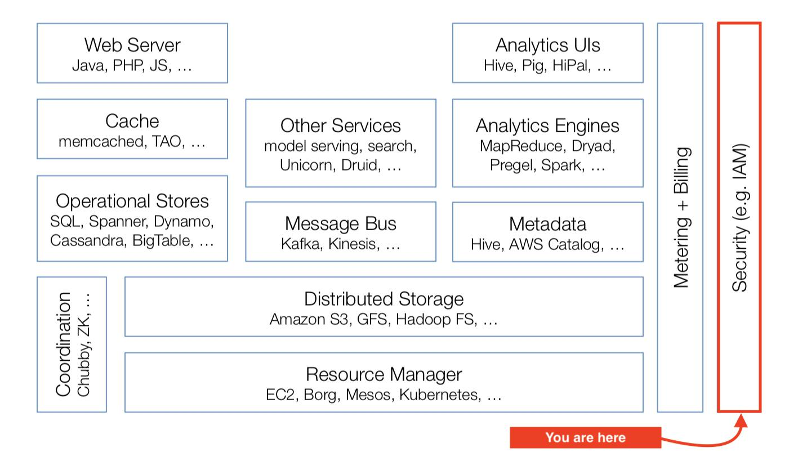

# 👤 Awesome Identity and Access Management 

In a Stanford class on [Cloud computing
overview](http://web.stanford.edu/class/cs349d/docs/L01_overview.pdf),
the software architecture is described as in the right diagram:

This knowledge base cover the far perimeter of the cloud stack. It is
one of the pillar of the cloud ecosystem, where users, products and
security meets. The [other pillar being billing & payments
💰](https://github.com/kdeldycke/awesome-billing/).

<!-- START doctoc generated TOC please keep comment here to allow auto update -->

<!-- DON'T EDIT THIS SECTION, INSTEAD RE-RUN doctoc TO UPDATE -->

## Contents

- [Meta](#meta)
- [Basics](#basics)
- [Cryptography](#cryptography)
- [Zero-trust Network](#zero-trust-network)
- [Authentication](#authentication)
  - [Password-based](#password-based)
  - [Password-less](#password-less)
  - [Security Key](#security-key)
  - [Multi-Factor](#multi-factor)
  - [SMS-based](#sms-based)
  - [Public-Key Infrastructure (PKI)](#public-key-infrastructure-pki)
  - [JWT](#jwt)
  - [OAuth2 & OpenID](#oauth2--openid)
  - [SAML](#saml)
- [Policies](#policies)
  - [Macaroons](#macaroons)
- [Secret Management](#secret-management)
  - [Hardware Security Module (HSM)](#hardware-security-module-hsm)
- [Trust & Safety](#trust--safety)
  - [User Identity](#user-identity)
  - [Fraud](#fraud)
  - [Threat Intelligence](#threat-intelligence)
  - [Captcha](#captcha)
- [Blacklists](#blacklists)
  - [Hostnames and Subdomains](#hostnames-and-subdomains)
  - [Emails](#emails)
  - [Reserved IDs](#reserved-ids)
  - [Profanity](#profanity)
- [Privacy](#privacy)
  - [Anonymization](#anonymization)
  - [GDPR](#gdpr)
- [UX/UI](#uxui)
- [Open-Source Projects](#open-source-projects)
- [Commercial Solutions](#commercial-solutions)
- [Competitive Analysis](#competitive-analysis)
- [History](#history)

<!-- END doctoc generated TOC please keep comment here to allow auto update -->

## Meta

- [IAM definition](https://en.wikipedia.org/wiki/Identity_management) -
    “A framework of policies and technologies for ensuring that the
    proper people in an enterprise have the appropriate access to
    technology resources”.
- [As a user, I
    want…](https://mobile.twitter.com/oktopushup/status/1030457418206068736) -
    A meta-critic of account management, in which features expected by
    the business clash with real user needs, in the form of user stories
    written by a fictional project manager.
- [Things end users care about but programmers
    don't](https://instadeq.com/blog/posts/things-end-users-care-about-but-programmers-dont/) -
    In the same spirit as above, but broader: all the little things we
    overlook as developers but users really care about. In the top of
    that list lies account-centric features, diverse integration and
    import/export tools. I.e. all the enterprise customers needs to
    cover.

## Basics

Strategy and feature lists of the domain.

- [The EnterpriseReady SaaS Feature
    Guides](https://www.enterpriseready.io) - The majority of the
    features making B2B users happy will be implemented by the IAM
    perimeter.
- [Enterprise Information Security](https://infosec.mozilla.org) -
    Mozilla's security and access guidelines.
- [Mitigating Cloud
    Vulnerabilities](https://media.defense.gov/2020/Jan/22/2002237484/-1/-1/0/CSI-MITIGATING-CLOUD-VULNERABILITIES_20200121.PDF) -
    “This document divides cloud vulnerabilities into four classes
    (misconfiguration, poor access control, shared tenancy
    vulnerabilities, and supply chain vulnerabilities)”.
- [Open guide to AWS Security and
    IAM](https://github.com/open-guides/og-aws#security-and-iam)
- [IAM Is The Real Cloud
    Lock-In](https://forrestbrazeal.com/2019/02/18/cloud-irregular-iam-is-the-real-cloud-lock-in/) -
    A little *click-baity*, but author admit that “It depends on how
    much you trust them to a) stay in business; b) not jack up your
    prices; c) not deprecate services out from under you; and d) provide
    more value to you in business acceleration than they take away in
    flexibility.”

## Cryptography

The whole authentication stack is based on cryptography primitives. This
can't be overlooked.

- [Cryptographic Right
    Answers](https://latacora.micro.blog/2018/04/03/cryptographic-right-answers.html)
    ([summary](https://news.ycombinator.com/item?id=16749140)) - An up
    to date set of recommendations for developers who are not
    cryptography engineers.
- [Security Recommendations for Any Device that Depends on
    Randomly-Generated
    Numbers](https://www.av8n.com/computer/htm/secure-random.htm) - “The
    phrase ‘random number generator’ should be parsed as follows: It is
    a random generator of numbers. It is not a generator of random
    numbers.”
- [Real World Crypto Symposium](https://rwc.iacr.org) - Aims to bring
    together cryptography researchers with developers, focusing on uses
    in real-world environments such as the Internet, the cloud, and
    embedded devices.
- [An Overview of
    Cryptography](https://www.garykessler.net/library/crypto.html) -
    “This paper has two major purposes. The first is to define some of
    the terms and concepts behind basic cryptographic methods, and to
    offer a way to compare the myriad cryptographic schemes in use
    today. The second is to provide some real examples of cryptography
    in use today.”
- [Papers we love:
    Cryptography](https://github.com/papers-we-love/papers-we-love/blob/master/cryptography/README.md) -
    Foundational papers of cryptography.
- [Lifetimes of cryptographic hash
    functions](http://valerieaurora.org/hash.html) - “If you are using
    compare-by-hash to generate addresses for data that can be supplied
    by malicious users, you should have a plan to migrate to a new hash
    every few years”.

## Zero-trust Network

Zero trust network security operates under the principle “never trust,
always verify.”.

- [BeyondCorp - A New Approach to Enterprise
    Security](https://www.usenix.org/system/files/login/articles/login_dec14_02_ward.pdf) -
    Quick overview of Google's Zero-trust Network initiative.
- [What is BeyondCorp? What is Identity-Aware
    Proxy?](https://medium.com/google-cloud/what-is-beyondcorp-what-is-identity-aware-proxy-de525d9b3f90) -
    More companies add extra layers of VPNs, firewalls, restrictions
    and constraints, resulting in a terrible experience and a slight
    security gain. There's a better way.
- [oathkeeper](https://github.com/ory/oathkeeper) - Identity & Access
    Proxy and Access Control Decision API that authenticates,
    authorizes, and mutates incoming HTTP requests. Inspired by the
    BeyondCorp / Zero Trust white paper.
- [transcend](https://github.com/cogolabs/transcend) -
    BeyondCorp-inspired Access Proxy server.
- [Pomerium](https://github.com/pomerium/pomerium) - An identity-aware
    proxy that enables secure access to internal applications.

## Authentication

Are you who you pretend to be?

- [Scaling backend authentication at
    Facebook](https://www.youtube.com/watch?v=kY-Bkv3qxMc)
    ([slides](https://rwc.iacr.org/2018/Slides/Lewi.pdf)) - TL;DR: Small
    root of trust, TLS isn't enough, certificate-based tokens and Crypto
    Auth Tokens (CATs).

### Password-based

- [The new NIST password
    guidance](https://pciguru.wordpress.com/2019/03/11/the-new-nist-password-guidance/) -
    A summary of [NIST Special
    Publication 800-63B](https://pages.nist.gov/800-63-3/sp800-63b.html)
    covering new password complexity guidelines.
- [Password expiration is
    dead](https://techcrunch.com/2019/06/02/password-expiration-is-dead-long-live-your-passwords/) -
    Recent scientific research calls into question the value of many
    long-standing password-security practices such as password
    expiration policies, and points instead to better alternatives such
    as enforcing banned-password lists and MFA.
- [Banks, Arbitrary Password Restrictions and Why They Don't
    Matter](https://www.troyhunt.com/banks-arbitrary-password-restrictions-and-why-they-dont-matter/) -
    “Arbitrary low limits on length and character composition are bad.
    They look bad, they lead to negative speculation about security
    posture and they break tools like password managers.”
- [Dumb Password
    Rules](https://github.com/dumb-password-rules/dumb-password-rules) -
    Shaming sites with dumb password rules.
- [Plain Text Offenders](https://plaintextoffenders.com/about/) -
    Public shaming of websites storing passwords in plain text.
- [Password Manager
    Resources](https://github.com/apple/password-manager-resources) - A
    collection of password rules, change URLs and quirks by sites.
- [A Well-Known URL for Changing
    Passwords](https://github.com/WICG/change-password-url) -
    Specification defining site resource for password updates.
- [How to change the hashing scheme of already hashed user's
    passwords](https://news.ycombinator.com/item?id=20109360) - You're
    not stuck with a legacy password hashing algorithm: this explain how
    to upgrade weak hashing algo.

### Password-less

- [An argument for
    passwordless](https://web.archive.org/web/20190515230752/https://biarity.gitlab.io/2018/02/23/passwordless/) -
    Passwords are not the be-all and end-all of user authentication.
    This article ties to tell you why.
- [WebAuthn guide](https://webauthn.guide) - A very accessible guide
    to WebAuthn, a standard allowing “servers to register and
    authenticate users using public key cryptography instead of a
    password”, supported by all major browsers.

### Security Key

- [Webauthn and security
    keys](https://www.imperialviolet.org/2018/03/27/webauthn.html) -
    Describe how authentication works with security keys, details the
    protocols, and how they articulates with WebAuthn. Key takeaway:
    “There is no way to create a U2F key with webauthn however. (…) So
    complete the transition to webauthn of your login process first,
    then transition registration.”
- [Getting started with security
    keys](https://paulstamatiou.com/getting-started-with-security-keys/) -
    A practical guide to stay safe online and prevent phishing with
    FIDO2, WebAuthn and security keys.
- [Solo](https://github.com/solokeys/solo) - Open security key
    supporting FIDO2 & U2F over USB + NFC.
- [OpenSK](https://github.com/google/OpenSK) - Open-source
    implementation for security keys written in Rust that supports both
    FIDO U2F and FIDO2 standards.
- [YubiKey Guide](https://github.com/drduh/YubiKey-Guide) - Guide to
    using YubiKey as a SmartCard for storing GPG encryption, signing and
    authentication keys, which can also be used for SSH. Many of the
    principles in this document are applicable to other smart card
    devices.
- [YubiKey at Datadog](https://github.com/DataDog/yubikey) - Guide to
    setup Yubikey, U2F, GPG, git, SSH, Keybase, VMware Fusion and Docker
    Content Trust.

### Multi-Factor

- [Breaking Password Dependencies: Challenges in the Final Mile at
    Microsoft](https://www.youtube.com/watch?v=B_mhJO2qHlQ) - The
    primary source of account hacks is password spraying (on legacy auth
    like SMTP, IMAP, POP, etc.), second is replay attack. Takeaway:
    password are insecure, use en enforce MFA.
- [Beyond Passwords: 2FA, U2F and Google Advanced
    Protection](https://www.troyhunt.com/beyond-passwords-2fa-u2f-and-google-advanced-protection/) -
    An excellent walk-trough over all these technologies.
- [A Comparative Long-Term Study of Fallback
    Authentication](https://www.mobsec.ruhr-uni-bochum.de/media/mobsec/veroeffentlichungen/2019/02/20/usec2019-30-wip-fallback-long-term-study-finalv2.pdf) -
    Key take-away: “schemes based on email and SMS are more usable.
    Mechanisms based on designated trustees and personal knowledge
    questions, on the other hand, fall short, both in terms of
    convenience and efficiency.”
- [How effective is basic account hygiene at preventing
    hijacking](https://security.googleblog.com/2019/05/new-research-how-effective-is-basic.html) -
    Google security team's data shows 2FA blocks 100% of automated bot
    hacks.
- [Your Pa$$word doesn't
    matter](https://techcommunity.microsoft.com/t5/Azure-Active-Directory-Identity/Your-Pa-word-doesn-t-matter/ba-p/731984) -
    Same conclusion as above from Microsoft: “Based on our studies,
    your account is more than 99.9% less likely to be compromised if you
    use MFA.”
- [Attacking Google
    Authenticator](https://unix-ninja.com/p/attacking_google_authenticator) -
    Probably on the verge of paranoia, but might be a reason to rate
    limit 2FA validation attempts.
- [Compromising online accounts by cracking voicemail
    systems](https://www.martinvigo.com/voicemailcracker/) - Or why you
    should not rely on automated phone calls as a method to reach the
    user and reset passwords, 2FA or for any kind of verification. Not
    unlike SMS-based 2FA, it is currently insecure and can be
    compromised by the way of its weakest link: voicemail systems.
- [Getting 2FA Right
    in 2019](https://blog.trailofbits.com/2019/06/20/getting-2fa-right-in-2019/) -
    On the UX aspects of 2FA.

### SMS-based

TL;DR: don't. For details, see articles below.

- [SMS 2FA auth is deprecated by
    NIST](https://techcrunch.com/2016/07/25/nist-declares-the-age-of-sms-based-2-factor-authentication-over/) -
    NIST has said that 2FA via SMS is bad and awful since 2016.
- [SMS: The most popular and least secure 2FA
    method](https://www.allthingsauth.com/2018/02/27/sms-the-most-popular-and-least-secure-2fa-method/)
- [Is SMS 2FA Secure? No.](https://www.issms2fasecure.com) -
    Definitive research project demonstrating successful attempts at SIM
    swapping.
- [Hackers Hit Twitter C.E.O. Jack Dorsey in a 'SIM Swap.' You're at
    Risk,
    Too.](https://www.nytimes.com/2019/09/05/technology/sim-swap-jack-dorsey-hack.html)
- [AT\&T rep handed control of his cellphone account to a
    hacker](https://www.theregister.co.uk/2017/07/10/att_falls_for_hacker_tricks/)
- [The Most Expensive Lesson Of My Life: Details of SIM port
    hack](https://medium.com/coinmonks/the-most-expensive-lesson-of-my-life-details-of-sim-port-hack-35de11517124)
- [SIM swap horror
    story](https://www.zdnet.com/article/sim-swap-horror-story-ive-lost-decades-of-data-and-google-wont-lift-a-finger/)
- [AWS is on its way to deprecate
    SMS-based 2FA](https://aws.amazon.com/iam/details/mfa/) - “We
    encourage you to use MFA through a U2F security key, hardware
    device, or virtual (software-based) MFA device. You can continue
    using this feature until January 31, 2019.”

### Public-Key Infrastructure (PKI)

Certificate-based authentication.

- [PKI for busy
    people](https://rehn.me/posts/pki-for-busy-people.html) - Quick
    overview of the important stuff.
- [Everything you should know about certificates and PKI but are too
    afraid to ask](https://smallstep.com/blog/everything-pki.html) - PKI
    lets you define a system cryptographically. It's universal and
    vendor neutral.
- [`lemur`](https://github.com/Netflix/lemur) - Acts as a broker
    between CAs and environments, providing a central portal for
    developers to issue TLS certificates with 'sane' defaults.

### JWT

[JSON Web Token](https://en.wikipedia.org/wiki/JSON_Web_Token) is a
bearer's token.

- [Introduction to JSON Web Tokens](https://jwt.io/introduction/) -
    Get up to speed on JWT with this article.
- [Learn how to use JWT for
    Authentication](https://github.com/dwyl/learn-json-web-tokens) -
    Learn how to use JWT to secure your web app.
- [Using JSON Web Tokens as API
    Keys](https://auth0.com/blog/using-json-web-tokens-as-api-keys/) -
    Compared to API keys, JWTs offers granular security, homogenous auth
    architecture, decentralized issuance, OAuth2 compliance,
    debuggability, expiration control, device management.
- [Managing a Secure JSON Web Token
    Implementation](https://cursorblog.com/managing-a-secure-json-web-token-implementation/) -
    JWT has all sorts of flexibility that make it hard to use well.
- [Hardcoded secrets, unverified tokens, and other common JWT
    mistakes](https://r2c.dev/blog/2020/hardcoded-secrets-unverified-tokens-and-other-common-jwt-mistakes/) -
    A good recap of all JWT pitfalls.
- [Blacklisting JSON Web Token API
    Keys](https://auth0.com/blog/blacklist-json-web-token-api-keys/) -
    On token invalidation.
- [Stop using JWT for
    sessions](http://cryto.net/~joepie91/blog/2016/06/13/stop-using-jwt-for-sessions/),
    and [Why your "solution" doesn't
    work](http://cryto.net/%7Ejoepie91/blog/2016/06/19/stop-using-jwt-for-sessions-part-2-why-your-solution-doesnt-work/) -
    Stateless JWT [tokens cannot be invalidated or
    updated](https://news.ycombinator.com/item?id=18354141), and will
    introduce either size issues or security issues depending on where
    you store them. Stateful JWT tokens are functionally the same as
    session cookies, but without the battle-tested and well-reviewed
    implementations or client support.
- [JWT, JWS and JWE for Not So
    Dummies\!](https://medium.facilelogin.com/jwt-jws-and-jwe-for-not-so-dummies-b63310d201a3) -
    A signed JWT is known as a JWS (JSON Web Signature). In fact a JWT
    does not exist itself — either it has to be a JWS or a JWE (JSON Web
    Encryption). Its like an abstract class — the JWS and JWE are the
    concrete implementations.
- [JOSE is a Bad Standard That Everyone Should
    Avoid](https://paragonie.com/blog/2017/03/jwt-json-web-tokens-is-bad-standard-that-everyone-should-avoid) -
    TL;DR: the standards are either completely broken or complex
    minefields hard to navigate.
- [JWT.io](https://jwt.io) - Allows you to decode, verify and generate
    JWT.
- [`loginsrv`](https://github.com/tarent/loginsrv) - Standalone
    minimalistic login server providing a JWT login for multiple login
    backends (htpasswd, OSIAM, user/password, HTTP basic authentication,
    OAuth2: GitHub, Google, Bitbucket, Facebook, Gitlab).

### OAuth2 & OpenID

[OAuth 2.0](https://en.wikipedia.org/wiki/OAuth#OAuth_2.0) is an
authorization framework. [OpenID Connect
(OIDC)](https://en.wikipedia.org/wiki/OpenID_Connect) is an
authentication layer on top of it.

The old *OpenID* is dead; the new *OpenID Connect* is very much
not-dead.

- [An Illustrated Guide to OAuth and OpenID
    Connect](https://developer.okta.com/blog/2019/10/21/illustrated-guide-to-oauth-and-oidc) -
    Explain how these standards work using simplified illustrations.
- [OAuth 2 Simplified](https://aaronparecki.com/oauth-2-simplified/) -
    A reference article describing the protocol in simplified format to
    help developers and service providers implement it.
- [OAuth 2.0 and OpenID Connect (in plain English)](https://www.youtube.com/watch?v=996OiexHze0) -  
    Starts with an historical context on how these standards came to be, clears up the innacuracies in the vocabulary, then details the protocols and its pitfalls to make it less intimidating.
- [Everything You Need to Know About OAuth (2.0)](https://gravitational.com/blog/everything-you-need-to-know-about-oauth/) -
    A good overview with a practical case study on how Teleport, an open-source remote access tool, allows users to log in through Github SSO.
- [How to Implement a Secure Central Authentication Service in Six
    Steps](https://engineering.shopify.com/blogs/engineering/implement-secure-central-authentication-service-six-steps) -
    Got multiple legacy systems to merge with their own login methods
    and accounts? Here is how to merge all that mess by the way of OIDC.
- [Open-Sourcing BuzzFeed's SSO
    Experience](https://increment.com/security/open-sourcing-buzzfeeds-single-sign-on-process/) -
    OAuth2-friendly adaptation of the Central Authentication Service
    (CAS) protocol. You'll find there good OAuth user flow diagrams.
- [The Decline of
    OpenID](https://penguindreams.org/blog/the-decline-of-openid/) -
    OpenID is being replaced in the public web to a mix of OAuth 1,
    OAuth 2 or other proprietary SSO protocols.
- [Why Mastercard Doesn't Use
    OAuth 2.0](https://developer.mastercard.com/blog/why-mastercard-doesnt-use-oauth-20) -
    “They did this to provide message-level integrity. OAuth 2
    switched to Transport-level confidentiality/Integrity.” (which TLS
    provides) ([source](https://news.ycombinator.com/item?id=17486165)).
- [OAuth 2.0 Security Best Current
    Practice](https://tools.ietf.org/html/draft-ietf-oauth-security-topics-15) -
    “Updates and extends the OAuth 2.0 Security Threat Model to
    incorporate practical experiences gathered since OAuth 2.0 was
    published and covers new threats relevant due to the broader
    application”.
- [Hydra](https://gethydra.sh) - Open-source OIDC & OAuth2 Server.
- [Cierge](https://web.archive.org/web/20190402111431/https://pwdless.github.io/Cierge-Website/) -
    Open-source authentication server (OIDC) that handles user signup,
    login, profiles, management, and more.
- [Keycloak](https://www.keycloak.org) - Open-source Identity and
    Access Management. Supports OIDC, OAuth 2 and SAML 2, LDAP and AD
    directories, password policies.

### SAML

Security Assertion Markup Language (SAML) 2.0 is a means to exchange authorization and authentication between
services, like OAuth/OpenID protocols above.

Typical SAML identity provider is an institution or a big corporation's
internal SSO, while the typical OIDC/OAuth provider is a tech company
that runs a data silo.

- [SAML vs. OAuth](https://www.cloudflare.com/learning/access-management/what-is-oauth/) - “OAuth is a protocol for authorization: it ensures Bob goes to the right parking lot. In contrast, SAML is a protocol for authentication, or allowing Bob to get past the guardhouse.”
- [The Difference Between SAML 2.0 and OAuth 2.0](https://www.ubisecure.com/uncategorized/difference-between-saml-and-oauth/) - “Even though SAML was actually designed to be widely applicable, its contemporary usage is typically shifted towards enterprise SSO scenarios. On the other hand, OAuth was designed for use with applications on the Internet, especially for delegated authorisation.”
- [What’s the Difference Between OAuth, OpenID Connect, and SAML?](https://www.okta.com/identity-101/whats-the-difference-between-oauth-openid-connect-and-saml/) - Identity is hard. Another take on the different protocol is always welcome to help makes sense of it all.
- [How SAML 2.0 Authentication
    Works](https://gravitational.com/blog/how-saml-authentication-works/) -
    Overview of the how and why of SSO and SAML.
- [Web Single Sign-On, the SAML 2.0
    perspective](https://blog.theodo.com/2019/06/web-single-sign-on-the-saml-2-0-perspective/) -
    Another naive explanation of SAML workflow in the context of
    corporate SSO implementation.
- [The Beer Drinker's Guide to
    SAML](https://duo.com/blog/the-beer-drinkers-guide-to-saml) - SAML
    is arcane at times. A another analogy might helps get more sense out
    of it.

## Policies

Now that we know you are you, are you allowed to perform what you want
to do?

All things related to access control policies, from classic [Access
Control Lists](https://en.wikipedia.org/wiki/Access-control_list) to
[Role Based Access
Control](https://en.wikipedia.org/wiki/Role-based_access_control).

- [Role Based Access
    Control](https://csrc.nist.gov/projects/role-based-access-control) -
    NIST project to explain RBAC concepts, costs and benefits, the
    economic impact of RBAC, design and implementation issues, the RBAC
    standard, and advanced research topics.
- [Semantic-based Automated Reasoning for AWS Access Policies using
    SMT](https://d1.awsstatic.com/Security/pdfs/Semantic_Based_Automated_Reasoning_for_AWS_Access_Policies_Using_SMT.pdf) -
    Zelkova is AWS's system performing symbolic analysis of IAM
    policies to solve the reachability of resources according user's
    rights and access constraints. Also see the higher-level
    [introduction given at
    re:inforce 2019](https://youtu.be/x6wsTFnU3eY?t=2111).
- [Zanzibar: Google's Consistent, Global Authorization
    System](https://ai.google/research/pubs/pub48190) - scales to
    trillions of access control lists and millions of authorization
    requests per second to support services used by billions of people.
    It has maintained 95th-percentile latency of less than 10
    milliseconds and availability of greater than 99.999% over 3 years
    of production use. [Other bits not in the
    paper](https://twitter.com/LeaKissner/status/1136626971566149633).
- [`keto`](https://github.com/ory/keto) - Policy decision point. It
    uses a set of access control policies, similar to AWS IAM Policies,
    in order to determine whether a subject is authorized to perform a
    certain action on a resource.
- [`ladon`](https://github.com/ory/ladon) - Access control library,
    inspired by [AWS IAM
    Policies](http://docs.aws.amazon.com/IAM/latest/UserGuide/access_policies.html).
- [Athenz](https://github.com/yahoo/athenz) - Set of services and
    libraries supporting service authentication and role-based
    authorization (RBAC) for provisioning and configuration.
- Description of an [authz system that is built around labeled
    security and RBAC
    concepts](https://news.ycombinator.com/item?id=20136831).
- [Become an AWS IAM Policy
    Ninja](https://www.youtube.com/watch?v=y7-fAT3z8Lo) - “In my nearly
    5 years at Amazon, I carve out a little time each day, each week to
    look through the forums, customer tickets to try to find out where
    people are having trouble.” Policy specification is the science,
    enforcement is the art.

### Macaroons

A clever curiosity to distribute and delegate authorization.

- [Google's Macaroons in Five Minutes or
    Less](https://blog.bren2010.io/2014/12/04/macaroons.html) - TL;DR:
    if I'm given a Macaroon that authorizes me to perform some action(s)
    under certain restrictions, I can non-interactively build a second
    Macaroon with stricter restrictions that I can then give to you.
- [Macaroons: Cookies with Contextual Caveats for Decentralized
    Authorization in the
    Cloud](https://ai.google/research/pubs/pub41892) - Google's original
    paper.
- [Google paper's author compares Macaroons and
    JWTs](https://news.ycombinator.com/item?id=14294463) - TL;DR: As a
    consumer/verifier of macaroons, they allow you (through third-party
    caveats) to defer some authorization decisions to someone else. JWTs
    don't.

## Secret Management

Architectures, software and hardware allowing the storage and usage of
secrets to allow for authentication and authorization, while maintaining
the chain of trust.

- [Secret at Scale at
    Netflix](https://www.youtube.com/watch?v=K0EOPddWpsE)
    ([slides](https://rwc.iacr.org/2018/Slides/Mehta.pdf)) - Solution
    based on blind signatures.
- [High Availability in Google's Internal
    KMS](https://www.youtube.com/watch?v=5T_c-lqgjso)
    ([slides](https://rwc.iacr.org/2018/Slides/Kanagala.pdf)) - Not
    GCP's KMS, but the one at the core of their infrastructure.
- [`vault`](https://www.vaultproject.io) - Secure, store and tightly
    control access to tokens, passwords, certificates, encryption keys.
- [`sops`](https://github.com/mozilla/sops) - Encrypts the values of
    YAML and JSON files, not the keys.
- [`gitleaks`](https://github.com/zricethezav/gitleaks) - Audit git
    repos for secrets.
- [`truffleHog`](https://github.com/dxa4481/truffleHog) - Searches
    through git repositories for high entropy strings and secrets,
    digging deep into commit history.
- [Keywhiz](https://square.github.io/keywhiz/) - A system for managing
    and distributing secrets, which can fit well with a service oriented
    architecture (SOA).
- [`roca`](https://github.com/crocs-muni/roca) - Python module to
    check for weak RSA moduli in various key formats.

### Hardware Security Module (HSM)

HSMs are physical devices guaranteeing security of secret management at
the hardware level.

- [HSM: What they are and why it's likely that you've (indirectly)
    used one
    today](https://rwc.iacr.org/2015/Slides/RWC-2015-Hampton.pdf) -
    Really basic overview of HSM usages.
- [Tidbits on AWS Cloud HSM
    hardware](https://news.ycombinator.com/item?id=16759383) - AWS
    CloudHSM Classic is backed by SafeNet's Luna HSM, current CloudHSM
    rely on Cavium's Nitrox, which allows for partitionable "virtual
    HSMs".
- [CrypTech](https://cryptech.is) - An open hardware HSM.
- [Keystone](https://keystone-enclave.org) - Open-source project for
    building trusted execution environments (TEE) with secure hardware
    enclaves, based on the RISC-V architecture.
- [Project Oak](https://github.com/project-oak/oak) - A specification
    and a reference implementation for the secure transfer, storage and
    processing of data.
- [Everybody be cool, this is a
    robbery\!](https://www.sstic.org/2019/presentation/hsm/) - A case
    study of vulnerability and exploitability of a HSM (in French,
    sorry).

## Trust & Safety

Once you've got a significant user base, it is called a community.
You'll then be responsible to protect it: the customer, people, the
company, the business, and facilitate all interactions and transactions
happening therein.

A critical intermediation complex driven by a policy and constraint by
local laws, the Trust & Safety department is likely embodied by a
cross-functional team of 24/7 operators and systems of highly advanced
moderation and administration tools. You can see it as an extension of
customer support services, specialized in edge-cases like manual
identity checks, moderation of harmful content, stopping harassment,
handling of warrants and copyright claims, data sequestration and other
credit card disputes.

- [Trust and
    safety 101](https://www.csoonline.com/article/3206127/trust-and-safety-101.html) -
    A great introduction on the domain and its responsabilities.
- [What the Heck is Trust and
    Safety?](https://www.linkedin.com/pulse/what-heck-trust-safety-kenny-shi) -
    A couple of real use-case to demonstrate the role of a TnS team.
- [Still Logged In: What AR and VR Can Learn from
    MMOs](https://youtu.be/kgw8RLHv1j4?t=534) - “If you host an online
    community, where people can harm another person: you are on the
    hook. And if you can't afford to be on the hook, don't host an
    online community”. All online communities, not only those related to
    gaming, requires their operator to invest a lot of resource and
    energy to moderate it.
- [Awesome List of Billing and Payments: Fraud
    links](https://github.com/kdeldycke/awesome-billing#fraud) - Section
    dedicated to fraud management for billing and payment, from our
    sister repository.

### User Identity

Most businesses do not collect customer's identity to create user
profiles to sell to third party, no. But you still have to: local laws
require to keep track of contract relationships under the large [Know
You Customer (KYC)](https://en.wikipedia.org/wiki/Know_your_customer)
banner.

- [The Laws of
    Identity](https://www.identityblog.com/stories/2005/05/13/TheLawsOfIdentity.pdf) -
    Is this paper aims at identity metasystem, its laws still provides
    great insights at smaller scale, especially the first law: to always
    allow user control and ask for consent to earn trust.
- [How Uber Got
    Lost](https://www.nytimes.com/2019/08/23/business/how-uber-got-lost.html) -
    “To limit "friction" Uber allowed riders to sign up without
    requiring them to provide identity beyond an email — easily faked —
    or a phone number. (…) Vehicles were stolen and burned; drivers were
    assaulted, robbed and occasionally murdered. The company stuck with
    the low-friction sign-up system, even as violence increased.”
- [Identity Beyond Usernames](https://lord.io/blog/2020/usernames/) -
    On the concept of usernames as identifiers, and the complexities
    introduced when unicode characters meets uniqueness requirements.
- [A Comparison of Personal Name Matching: Techniques and Practical
    Issues](http://users.cecs.anu.edu.au/~Peter.Christen/publications/tr-cs-06-02.pdf) -
    Customer name matching has lots of application, from account
    deduplication to fraud monitoring.
- [`hive`](https://github.com/ory/hive) - User & Identity Provider &
    Management.
- [Statistically Likely
    Usernames](https://github.com/insidetrust/statistically-likely-usernames) -
    Wordlists for creating statistically likely usernames for use in
    username-enumeration, simulated password-attacks and other security
    testing tasks.
- [Sherlock](https://github.com/sherlock-project/sherlock) - Hunt down
    social media accounts by username across social networks.

### Fraud

As an online service provider, you're exposed to fraud, crime and
abuses. You'll be surprised by how much people gets clever when it comes
to money. Expect any bug or discrepancies in your workflow to be
exploited for financial gain.

- [After Car2Go eased its background checks, 75 of its vehicles were
    stolen in one day.](https://archive.is/MuNrZ) - Why background check
    are sometimes necessary.
- [Investigation into the Unusual
    Signups](https://openstreetmap.lu/MWGGlobalLogicReport20181226.pdf) -
    A really detailed analysis of suspicious contributor signups on
    OpenStreetMap. This beautiful and high-level report demonstrating an
    orchestrated and directed campaign might serve as a template for
    fraud reports.
- [MIDAS: Detecting Microcluster Anomalies in Edge
    Streams](https://github.com/bhatiasiddharth/MIDAS) - A proposed
    method to “detects microcluster anomalies, or suddenly arriving
    groups of suspiciously similar edges, in edge streams, using
    constant time and memory.”
- [Gephi](https://github.com/gephi/gephi) - Open-source platform for
    visualizing and manipulating large graphs.

### Threat Intelligence

How to detect, unmask and classify offensive online activities. Most of
the time these are monitored by security, networking and/or
infrastructure engineering teams. Still, these are good resources for
T\&S and IAM people, who might be called upon for additional expertise
for analysis and handling of threats.

- [Awesome Threat
    Intelligence](https://github.com/hslatman/awesome-threat-intelligence) -
    “A concise definition of Threat Intelligence: evidence-based
    knowledge, including context, mechanisms, indicators, implications
    and actionable advice, about an existing or emerging menace or
    hazard to assets that can be used to inform decisions regarding the
    subject's response to that menace or hazard.”
- [SpiderFoot](https://github.com/smicallef/spiderfoot) - An open
    source intelligence (OSINT) automation tool. It integrates with just
    about every data source available and uses a range of methods for
    data analysis, making that data easy to navigate.
- [Standards related to Threat
    Intelligence](https://www.threat-intelligence.eu/standards/) - Open
    standards, tools and methodologies to support threat intelligence
    analysis.
- [MISP taxonomies and
    classification](https://www.misp-project.org/taxonomies.html) - Tags
    to organize information on “threat intelligence including cyber
    security indicators, financial fraud or counter-terrorism
    information.”
- [Browser Fingerprinting: A
    survey](https://arxiv.org/pdf/1905.01051.pdf) - Fingerprints can be
    used as a source of signals to identify bots and fraudsters.
- [The challenges of file
    formats](https://speakerdeck.com/ange/the-challenges-of-file-formats) -
    At one point you will let users upload files in your system. Here
    is a [corpus of suspicious media
    files](https://github.com/corkami/pocs) that can be leveraged by
    scammers =to bypass security or fool users.
- [SecLists](https://github.com/danielmiessler/SecLists) - Collection
    of multiple types of lists used during security assessments,
    collected in one place. List types include usernames, passwords,
    URLs, sensitive data patterns, fuzzing payloads, web shells, and
    many more.
- [PhoneInfoga](https://github.com/sundowndev/PhoneInfoga) - Tools to
    scan phone numbers using only free resources. The goal is to first
    gather standard information such as country, area, carrier and line
    type on any international phone numbers with a very good accuracy.
    Then search for footprints on search engines to try to find the VoIP
    provider or identify the owner.
- [Confusable
    Homoglyphs](https://github.com/vhf/confusable_homoglyphs) -
    Homoglyphs is a common phishing trick.

### Captcha

Another line of defense against spammers.

- [Awesome Captcha](https://github.com/ZYSzys/awesome-captcha) -
    Reference all open-source captcha libraries, integration,
    alternatives and cracking tools.
- [reCaptcha](https://www.google.com/recaptcha) - reCaptcha is still
    an effective, economical and quick solution when your company can't
    afford to have a dedicated team to fight bots and spammers at
    internet scale.
- [You (probably) don't need
    ReCAPTCHA](https://kevv.net/you-probably-dont-need-recaptcha/) -
    Starts with a rant on how the service is a privacy nightmare and is
    tedious UI-wise, then list alternatives.
- [Anti-captcha](https://anti-captcha.com) - Captchas solving service.

## Blacklists

The first mechanical line of defense against abuses consist in plain and
simple black-listing. This is the low-hanging fruit of fraud fighting,
but you'll be surprised how they're still effective.

- [Bloom Filter](https://en.wikipedia.org/wiki/Bloom_filter) - Perfect
    for this use-case, as bloom filters are designed to quickly check if
    an element is not in a (large) set. Variations of bloom filters
    exist for specific data types.
- [How Radix trees made blocking IPs 5000 times
    faster](https://blog.sqreen.com/demystifying-radix-trees/) - Radix
    trees might come handy to speed-up IP blacklists.

### Hostnames and Subdomains

Useful to identified clients, catch and block swarms of bots, and limit
effects of dDOS.

- [`hosts`](https://github.com/StevenBlack/hosts) - Consolidates
    reputable hosts files, and merges them into a unified hosts file
    with duplicates removed.
- [`nextdns/metadata`](https://github.com/nextdns/metadata) -
    Extensive collection of list for security, privacy and parental
    control.
- [The Public Suffix List](https://publicsuffix.org) - Mozilla's
    registry of public suffixes, under which Internet users can (or
    historically could) directly register names.
- [Country IP
    Blocks](https://github.com/herrbischoff/country-ip-blocks) - CIDR
    country-level IP data, straight from the Regional Internet
    Registries, updated hourly.
- [Certificate Transparency
    Subdomains](https://github.com/internetwache/CT_subdomains) - An
    hourly updated list of subdomains gathered from certificate
    transparency logs.
- Subdomain blacklists: [\#1](https://gist.github.com/artgon/5366868),
    [\#2](https://github.com/sandeepshetty/subdomain-blacklist/blob/master/subdomain-blacklist.txt),
    [\#3](https://github.com/nccgroup/typofinder/blob/master/TypoMagic/datasources/subdomains.txt),
    [\#4](https://www.quora.com/How-do-sites-prevent-vanity-URLs-from-colliding-with-future-features).
- [`common-domain-prefix-suffix-list.tsv`](https://gist.github.com/erikig/826f49442929e9ecfab6d7c481870700) -
    Top-5000 most common domain prefix/suffix list.
- [`hosts-blocklists`](https://github.com/notracking/hosts-blocklists) -
    No more ads, tracking and other virtual garbage.
- [`xkeyscorerules100.txt`](https://gist.github.com/sehrgut/324626fa370f044dbca7) -
    NSA's [XKeyscore](https://en.wikipedia.org/wiki/XKeyscore)
    matching rules for TOR and other anonymity preserving tools.
- [`pyisp`](https://github.com/ActivisionGameScience/pyisp) - IP to
    ISP lookup library (includes ASN).
- [AMF site
    blacklist](https://www.amf-france.org/Epargne-Info-Service/Proteger-son-epargne/Listes-noires) -
    Official French blacklist of money-related fraud sites.

### Emails

- [Burner email
    providers](https://github.com/wesbos/burner-email-providers) - A
    list of temporary email providers. And its [derivative Python
    module](https://github.com/martenson/disposable-email-domains).
- [MailChecker](https://github.com/FGRibreau/mailchecker) -
    Cross-language temporary (disposable/throwaway) email detection
    library.
- [Temporary Email Address
    Domains](https://gist.github.com/adamloving/4401361) - A list of
    domains for disposable and temporary email addresses. Useful for
    filtering your email list to increase open rates (sending email to
    these domains likely will not be opened).
- [`gman`](https://github.com/benbalter/gman) - “A ruby gem to check
    if the owner of a given email address or website is working for THE
    MAN (a.k.a verifies government domains).” Good resource to hunt for
    potential government customers in your user base.
- [`Swot`](https://github.com/leereilly/swot) - In the same spirit as
    above, but this time to flag academic users.

### Reserved IDs

- [General List of Reserved
    Words](https://gist.github.com/stuartpb/5710271) - This is a general
    list of words you may want to consider reserving, in a system where
    users can pick any name.
- [Hostnames and usernames to
    reserve](https://ldpreload.com/blog/names-to-reserve) - List of all
    the names that should be restricted from registration in automated
    systems.

### Profanity

- [List of Dirty, Naughty, Obscene, and Otherwise Bad
    Words](https://github.com/LDNOOBW/List-of-Dirty-Naughty-Obscene-and-Otherwise-Bad-Words) -
    Profanity blacklist from Shutterstock.
- [`profanity-check`](https://github.com/vzhou842/profanity-check) -
    Uses a linear SVM model trained on 200k human-labeled samples of
    clean and profane text strings.

## Privacy

As the guardian of user's data, the IAM stack is deeply bounded by the
respect of privacy.

- [Paper we love:
    Privacy](https://github.com/papers-we-love/papers-we-love/tree/master/privacy) -
    A collection of scientific studies of schemes providing privacy by
    design.
- [IRMA Authentication](https://news.ycombinator.com/item?id=20144240) -
    Open-source app and protocol that offers privacy-friendly
    attribute based authentication and signing using [Camenisch and
    Lysyanskaya's
    Idemix](https://privacybydesign.foundation/publications/).
- [Have I been Pwned?](https://haveibeenpwned.com) - Data breach
    index.
- [Automated security testing for Software
    Developers](https://fahrplan.events.ccc.de/camp/2019/Fahrplan/system/event_attachments/attachments/000/003/798/original/security_cccamp.pdf) -
    Most privacy breaches were allowed by known vulnerabilities in
    third-party dependencies. Here is how to detect them by the way of
    CI/CD.
- [Email marketing regulations around the
    world](https://github.com/threeheartsdigital/email-marketing-regulations) -
    As the world becomes increasingly connected, the email marketing
    regulation landscape becomes more and more complex.

### Anonymization

As a central repository of user data, the IAM stack stakeholders have to
prevent any leakage of business and customer data. To allow for internal
analytics, anonymization is required.

- [The False Allure of Hashing for
    Anonymization](https://gravitational.com/blog/hashing-for-anonymization/) -
    Hashing is not sufficient for anonymization no. But still it is
    good enough for pseudonymization (which is allowed by the GDPR).
- [Four cents to deanonymize: Companies reverse hashed email
    addresses](https://freedom-to-tinker.com/2018/04/09/four-cents-to-deanonymize-companies-reverse-hashed-email-addresses/) -
    “Hashed email addresses can be easily reversed and linked to an
    individual”.
- [Why differential privacy is
    awesome](https://desfontain.es/privacy/differential-privacy-awesomeness.html) -
    Explain the intuition behind [differential
    privacy](https://en.wikipedia.org/wiki/Differential_privacy), a
    theoretical framework which allow sharing of aggregated data without
    compromising confidentiality. See follow-up articles with [more
    details](https://desfontain.es/privacy/differential-privacy-in-more-detail.html)
    and [practical
    aspects](https://desfontain.es/privacy/differential-privacy-in-practice.html).
- [k-anonymity: an
    introduction](https://www.privitar.com/listing/k-anonymity-an-introduction) -
    An alternative anonymity privacy model.
- [Presidio](https://github.com/microsoft/presidio) - Context aware,
    pluggable and customizable data protection and PII data
    anonymization service for text and images.
- [Diffix: High-Utility Database
    Anonymization](https://aircloak.com/wp-content/uploads/apf17-reprint.pdf) -
    Diffix try to provide anonymization, avoid pseudonymization and
    preserve data quality. [Written in Elixir at
    Aircloak](https://elixirforum.com/t/aircloak-anonymized-analitycs/10930),
    it acts as an SQL proxy between the analyst and an unmodified live
    database.

### GDPR

The well-known European privacy framework

- [GDPR Tracker](https://gdpr.eu) - Europe's reference site.
- [GDPR Developer
    Guide](https://github.com/LINCnil/GDPR-Developer-Guide) - Best
    practices for developers.
- [GDPR – A Practical guide for
    Developers](https://techblog.bozho.net/gdpr-practical-guide-developers/) -
    A one-page summary of the above.
- [GDPR Tracker](https://gdprtracker.io) - Track the GDPR compliance
    of cloud services and subprocessors.
- [GDPR documents](https://github.com/good-lly/gdpr-documents) -
    Templates for personal use to have companies comply with "Data
    Access" requests.
- [Dark Patterns after the GDPR](https://arxiv.org/pdf/2001.02479.pdf) -
    This paper demonstrates that, because of the lack of GDPR law enforcements,
    dark patterns and implied consent are ubiquitous.
- [GDPR Enforcement Tracker](http://enforcementtracker.com) - List of
    GDPR fines and penalties.
- [Ship Your Enemies GDPR](https://shipyourenemiesgdpr.com) -
    Weaponizing GDPR to help you send your enemies a Data Requests
    designed to waste as much of their time as possible.

## UX/UI

As stakeholder of the IAM stack, you're going to implement in the
backend the majority of the primitives required to build-up the sign-up
tunnel and user onboarding. This is the first impression customers will
get from your product, and can't be overlooked: you'll have to carefully
design it with front-end experts. Here is a couple of guides to help you
polish that experience.

- [The 2020 State of SaaS Product
    Onboarding](https://userpilot.com/saas-product-onboarding/) - Covers
    all the important facets of user onboarding.
- [User Onboarding
    Teardowns](https://www.useronboard.com/user-onboarding-teardowns/) -
    A huge list of deconstructed first-time user signups.
- [Discover UI Design Decisions Of Leading
    Companies](https://goodui.org/leaks/) - From Leaked Screenshots &
    A/B Tests.
- [Conversion
    Optimization](https://www.nickkolenda.com/conversion-optimization-psychology/#cro-tactic11) -
    A collection of tactics to increase the chance of users finishing
    the account creation funnel.
- [Trello User
    Onboarding](https://growth.design/case-studies/trello-user-onboarding/) -
    A detailed case study, nicely presented, on how to improve user
    onboarding.
- [Don't get clever with login
    forms](http://bradfrost.com/blog/post/dont-get-clever-with-login-forms/) -
    TL;DR: create login forms that are simple, linkable, predictable,
    and play nicely with password managers.
- [Why are the username and password on two different
    pages?](https://www.twilio.com/blog/why-username-and-password-on-two-different-pages) -
    TL;DR: to support both SSO and password-based login. Now if
    breaking the login funnel in 2 steps is too infuriating to users,
    solve this as Dropbox does: [an AJAX request when you enter your
    username](https://news.ycombinator.com/item?id=19174355).
- [HTML attributes to improve your users' two factor authentication
    experience](https://www.twilio.com/blog/html-attributes-two-factor-authentication-autocomplete) -
    “In this post we will look at the humble `<input>` element and the
    HTML attributes that will help speed up our users' two factor
    authentication experience”.
- [Remove password masking](http://passwordmasking.com) - Summarizes
    the results from an academic study investigating the impact removing
    password masking has on consumer trust.
- [For anybody who thinks "I could build that in a weekend," this is
    how Slack decides to send a
    notification](https://twitter.com/ProductHunt/status/979912670970249221) -
    Notifications are hard. Really hard.

## Open-Source Projects

A couple of open-sources projects waiting to find a more appropriate
section above.

- [Open Policy Agent](https://github.com/open-policy-agent/opa)
- [Casbin](https://github.com/casbin/casbin)
- [IdentityServer](https://identityserver.io)
- [gluu](https://www.gluu.org)
- [Conjur](https://www.conjur.org)
- [Gubernator](https://github.com/mailgun/gubernator) - High
    Performance Rate Limiting MicroService and Library.

## Commercial Solutions

- [Rippling IDM](https://www.rippling.com/idm/) - Identity management,
    SSO.

## Competitive Analysis

A bunch of resources to keep track of the current status and progress of
all companies operating in the domain.

- [AWS Security, Identity & Compliance
    announcements](https://aws.amazon.com/about-aws/whats-new/security_identity_and_compliance/).
- [GCP IAM release
    notes](https://cloud.google.com/iam/docs/release-notes) - Also of
    note:
    [Identity](https://cloud.google.com/identity/docs/release-notes),
    [Identity
    Platform](https://cloud.google.com/identity-platform/docs/release-notes),
    [Resource
    Manager](https://cloud.google.com/resource-manager/docs/release-notes),
    [Key Management
    Service/HSM](https://cloud.google.com/kms/docs/release-notes),
    [Access Context
    Manager](https://cloud.google.com/access-context-manager/docs/release-notes),
    [Identity-Aware
    Proxy](https://cloud.google.com/iap/docs/release-notes), [Data Loss
    Prevention](https://cloud.google.com/dlp/docs/release-notes) and
    [Security
    Scanner](https://cloud.google.com/security-scanner/docs/release-notes).
- [Unofficial Weekly Google Cloud Platform
    newsletter](https://www.gcpweekly.com) - Relevant keywords:
    [`IAM`](https://www.gcpweekly.com/gcp-resources/tag/iam/) and
    [`Security`](https://www.gcpweekly.com/gcp-resources/tag/security/).
- [DigitalOcean Platform
    changelog](https://www.digitalocean.com/docs/platform/release-notes/)
- [163 AWS services explained in one line
    each](https://adayinthelifeof.nl/2020/05/20/aws.html#discovering-aws) -
    Help makes sense of their huge service catalog. In the same
    spirit: [AWS in simple
    terms](https://netrixllc.com/blog/aws-services-in-simple-terms/) &
    [AWS In Plain
    English](https://expeditedsecurity.com/aws-in-plain-english/).

## History

- [cryptoanarchy.wiki](https://cryptoanarchy.wiki) - Cypherpunks
    overlaps with security. This wiki compiles information about the
    movement, its history and the people/events of note.

## Contributing

Your contributions are always welcome\! Please take a look at the
[contribution guidelines](./.github/contributing.md) first.

## License

Content of this repository is licensed under the [Creative Commons CC0
license](https://creativecommons.org/publicdomain/zero/1.0/). To the
extent possible under law, [Kevin Deldycke](https://kevin.deldycke.com)
has waived all copyright and related or neighboring rights to this work.
